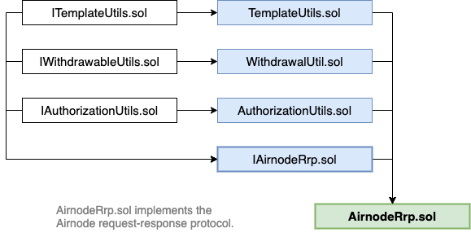

# {{$frontmatter.title}}

<TocHeader />
<TOC class="table-of-contents" :include-level="[2,3]" />

The first protocol implemented for Airnode is request–response.
An Airnode serving the request–response protocol listens for requests, makes the API call specified by the request, and fulfills the request as soon as possible.

## Contracts

The request–response protocol is implemented as a single permissionless contract that all Airnodes interact with, which is named `AirnodeRrp.sol`. This base contract has the following inheritance tree that compartmentalizes the aspects of the protocol.

  >  

### AirnodeRrp.sol

The [AirnodeRrp.sol](https://github.com/api3dao/airnode/blob/master/packages/protocol/contracts/AirnodeRrp.sol) contract sits between a requester and the Airnode. It inherits from four additional contracts as illustrated in the diagram above.

- Used by requesters to make requests.
- Used by Airnodes to fulfill requests.

The [Admin](../../cli-commands.md) (`@api3/airnode-admin`) package is a CLI tool used to interact with `AirnodeRrp.sol` and perform administrative actions for the [concepts](general-structure.md#concepts) discussed below. See the [admin package](https://github.com/api3dao/airnode/tree/master/packages/admin) in GitHub.

To use AirnodeRrp.sol a requester must import AirnodeRrpClient.sol.

`import "@api3/airnode-protocol/contracts/AirnodeRrpClient.sol";`

### IAirnodeRrp.sol

The [IAirnodeRrp.sol](https://github.com/api3dao/airnode/blob/master/packages/protocol/contracts/rrp/interfaces/IAirnodeRrp.sol) contract <FixInline>Add summary, see the pre-alpha docs.</FixInline>

- <FixInline>add bullet highlights</FixInline>
- 

### AuthorizationUtils.sol

The [AuthorizationUtils.sol](https://github.com/api3dao/airnode/blob/master/packages/protocol/contracts/rrp/AuthorizationUtils.sol) contract <FixInline>Add summary, see the pre-alpha docs.</FixInline>

- <FixInline>add bullet highlights</FixInline>

### WithdrawalUtils.sol

The [WithdrawalUtils.sol](https://github.com/api3dao/airnode/blob/master/packages/protocol/contracts/rrp/WithdrawalUtils.sol) contract <FixInline>Add summary, see the pre-alpha docs.</FixInline>

- <FixInline>add bullet highlights</FixInline>

### TemplateUtils.sol

The [TemplateUtils.sol](https://github.com/api3dao/airnode/blob/master/packages/protocol/contracts/rrp/TemplateUtils.sol) contract <FixInline>Add summary, see the pre-alpha docs.</FixInline>

- <FixInline>add bullet highlights</FixInline>
- 

## Concepts

The remainder of the Request-Response Protocol directory contains details about the concepts of the protocol. Click the links below (or in the sidebar navigator) for the page of the specific concept. It is recommended to read these in the given order.

1. An [Airnode](airnode.md) serves one or more APIs to smart contracts.

1. Each of the API operations that the Airnode serves is accessible over an [endpoint](endpoint.md). The Airnode sets [authorizers](authorizer.md) for these endpoints, which are contracts that implement authorization policies.

1. A [sponsor](sponsor.md) owns contracts that make requests to Airnodes. Each of these contracts is called a [requester](requester.md).

1. Each Airnode keeps a [sponsor wallet](sponsor-wallet.md) for each sponsor that creates one. The sponsor [sponsors](sponsor.md) their requesters allowing them to make requests that will be fulfilled by the sponsor's sponsor wallet.

1. A requester can create a request [template](template.md), which is an on-chain record that they can refer to while making [requests](request.md).
